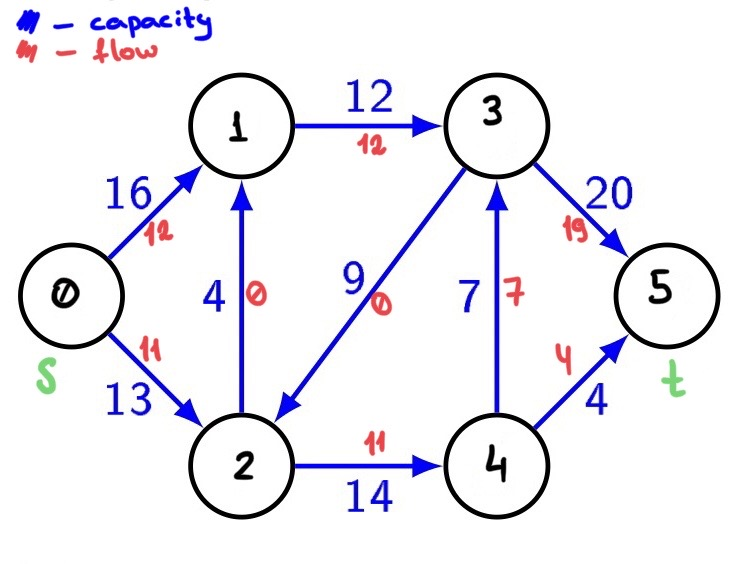

# Dinic's algorithm
Программа реализует [алгоритм Диница](https://en.wikipedia.org/wiki/Dinic%27s_algorithm) для нахождения максимального потока
в ориентированном графе за время O(n<sup>2</sup>m), где `n` - число вершин графа,
`m` - число ребер

## Работа с программой
### Входные данные
На вход программе подается описание ориентированного графа.
В первой строке вводятся четыре числа `n, m, s, t`- 
число вершин и ребер 
в графе, исток и сток потока соответственно. Вершины графа нумеруются целыми числами 
от `0` до `n - 1`.
В следующих `m` строках идет описание ребер - 
начальная вершина, конечная вершина и
пропускная способность ребра. Пропускные способности -
неотрицательные вещественные числа. 
### Результат
В первой строчке результата выводится вещественное число - значение
максимального потока
Далее выводится n строк матрицы, в клетке (v, u) которой находися
значение потока на ребере (v, u)

## Пример работы 
[data/sample_input.txt](data/sample_input.txt)
```
input:
6 9 0 5
0 1 16
0 2 13
1 3 12
2 1 4
2 4 14
3 2 9
3 5 20
4 3 7
4 5 4

output:
23
0 12 11 0 0 0 
0 0 0 12 0 0 
0 0 0 0 11 0 
0 0 0 0 0 19 
0 0 0 7 0 4 
0 0 0 0 0 0 
```
В этом графе 6 вершин и 9 ребер, максимальнынй возможный поток - 23
